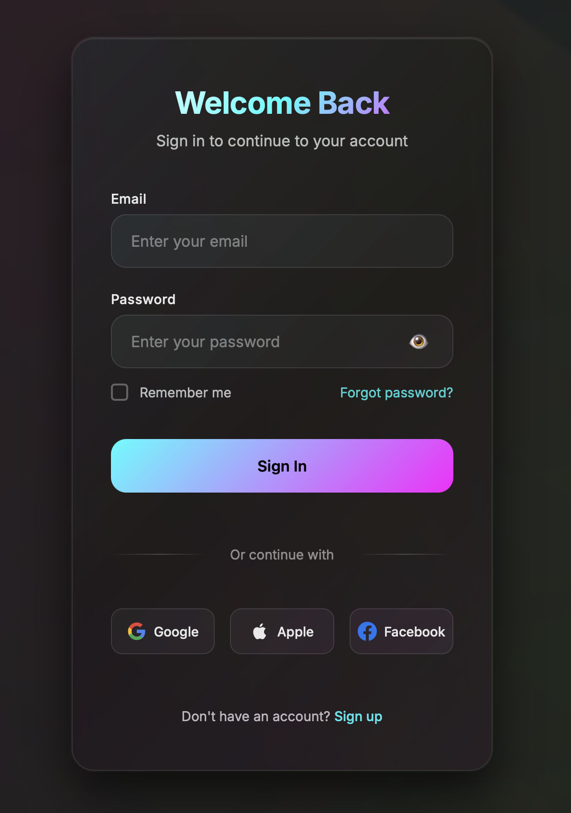

#   Login Page  3

A professional, modern login page with **animated neon wave background** and **glassmorphism design**, inspired by **Spotify's dark aesthetic**.  

---

##  Preview  

### 🌊 Interactive Background  
1. **Neon Wave Animation** – multi-colored glowing gradients with smooth curves  
2. **Mouse Interactivity** – waves scale, jump, and pulse on hover/mouse movement  
3. **Dynamic Depth** – creates a lively, interactive environment  

###  Glassmorphism Design  
1. **Semi-transparent Login Box** – frosted glass effect with blur  
2. **Glowing Borders** – subtle neon accents and drop shadows  
3. **Spotify-inspired Aesthetic** – dark mode UI with modern typography  

### 🎨 Visual Effects  
1. Hover animations with neon glow  
2. Real-time validation (color-coded feedback)  
3. Success/error notifications with blur  
4. Smooth loading states during form submission  
5. Ripple effects for interactive buttons  
